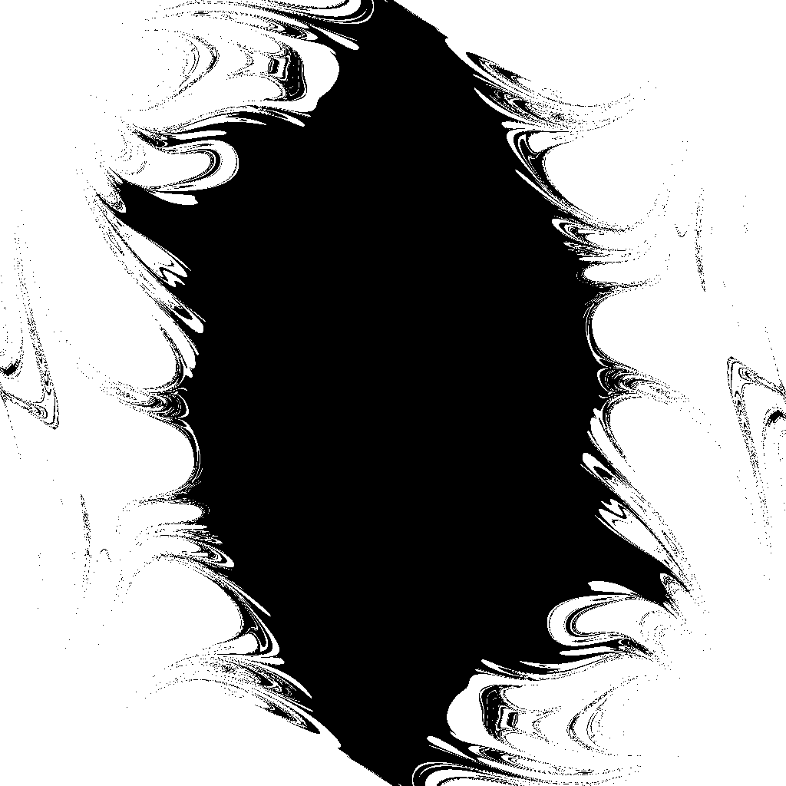
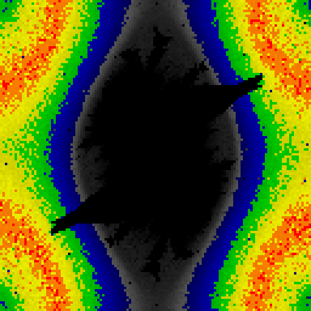

# Pendulum Fractals

This repository contains code for simulating double pendulums on the CPU and GPU. Fractals can be generated by varying the starting conditions of each pendulum simulation (for example changing the starting angles of the upper and lower pendulum arm) and checking whether a certain condition is met after a predetermined amount of time.

The example image above varies each pendulum arm independently on the x and y axes, and sets the corresponding pixel to white if any of the pendulum arms have flipped within 10 seconds, otherwise the color remains black.

Due to the parallel nature of these simulations, a significant performance increase can be achived by letting the GPU process each individual pendulum simultaneously (however at the cost of losing some precision).

A similar method was used to generate the Lyapunov exponent image above (i.e. each pixel corresponds to a starting angle of each pendulum arm). However this time two separate double pendulums were simulated for each pixel where one slightly differs in its starting position from the other. The rate at which the two pendulums diverge determines the pixels color from smallest divergence to greates in: black, blue, green, yellow, orange, red.
