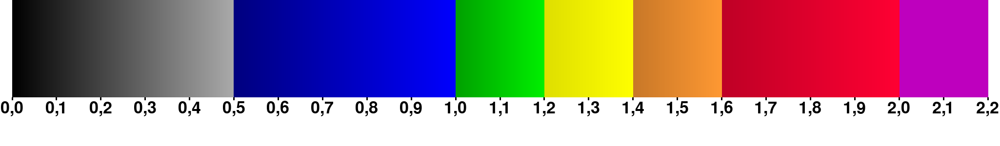

# Fractal Dimension as an Indicator for Divergence in Double Pendulums
This repository contains a summary of the project *Fractal Dimension as an Indicator for Divergence in Double Pendulums*, written as a final project of high scool ("gymnasiearbete") by
- Adam Johansson
- Olle Ahlin
- Anton Mattsson
- Victor Millberg

In the project, fractals were generated by considering a grid of initial conditions for a double pendulums. If $\alpha$ and $\beta$ respectively are the angles of the inner and outer rod against the verical, we can simulate a double pendulum for some time and then look at whether either pendlum arm flipped over vertically during the simulated time. We may pot the result against the initial condition as an image, which might look a bit like the image below:

The image above is for a double pendulum with equal rod lengths $l_1=l_2=1$ m in earth gravity $g=9.82$ m/s^2 simulated for $10$ s. The project considered a number of these fractals by varying system parameters like lengths and masses, and computed the fractal dimension for each. The hypothesis was that systems with faster chaotic divergence rates would produce more rugged fractals, and that their fractal dimensions would consequently be greater.

This hypothesis was tested by comparing fractal dimension against the *Maximum Lyapunov Exponent (MLE)*, being the average exponential rate of chaotic divergence, in the sense that two separate trajectories $y_1$ and $y_2$ with separation $\delta(t)=y_2(t)-y_1(t)$ would on average show $\delta(t) = \delta(0)e^{\lambda_1 t}$ where $\lambda_1$ is the MLE. Below is a similar plot to the above, but where the colour shows MLE as a function of initial condition

Our results showed that a slight correlation between the coputed fractal dimensions and the MLE existed, but seeing as the data had a very large spread, it was hard to draw any definitive conclusions as to whether this behaviour would be expected in other systems as well.

The full report (in swedish) is found at (Rapport/Rapport.pdf)[Rapport/Rapport.pdf]

# Comments on implementation

The simulations where carried out using fourth order Runge Kutta with a time step of 0.001 s. 
